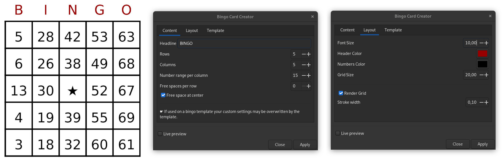
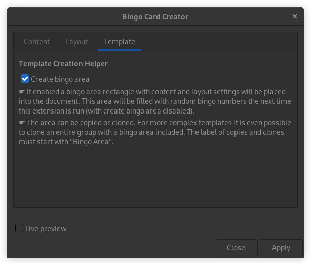

## Inkscape Extension: Bingo Card Creator

Adds "Bingo Card Creator" to the Inkscape Extensions list.

### How To Install

Copy the bingo folder from this repository into the Inkscape extensions folder.

Works with Inkscape 1.2

### How To Use

* Open Extensions > Render > Bingo Card Creator
* Set parameters as necessary and apply

## Bingo Templates

When the extension is used on a document (template) with a bingo area, it will insert the bingo numbers into the predefined area(s) with predefined settings.

### Create Bingo Areas

* Open the Bingo Card Creator extension and set your content and layout settings.
* Switch to the template tab and enable `create bingo area` and apply.

This will include a bingo area into your document. You can now design your template. Group your design, select the group and clone the group. Label the clone to `Bingo Area` in the layer and objects dialog (Object > Layers and Objects). Create as many clones as you need. When finished run the Bingo Card Creator extension again. Disable create bingo area in the template tab and apply. All bingo areas will be filled with random numbers at once.

### Manual setup of bingo areas

Create a bingo template by setting the label of a rectangle to `Bingo Area`. Clones of bingo-area-rectangles or clones of groups can also be used by setting their label accordingly. Optionally append numbers to the label such as `Bingo Area #1` when multiple areas are in the document.

Use Inkscapes XML-Editor to add following attributes to the bingo-area-rectangle (optional):

#### Layout options

|Attribute           |Type   |Example |Description
|--------------------|-------|--------|-----------|
|bingo-columns       |int    |5       |Number of columns
|bingo-rows          |int    |5       |Number of rows
|bingo-column-range  |int    |15      |Number range for each column
|bingo-render-grid   |boolean|false   |If set to true a grid will be rendered

#### Headline, font and colors

|Attribute           |Type   |Example |Description
|--------------------|-------|--------|-----------|
|bingo-headline      |string |BINGO   |The headline text (`none`: no headline)
|bingo-font-size     |float  |20.5    |Font Size
|bingo-headline-color|color  |black   |Headline color
|bingo-color         |color  |#000000 |The color for the numbers

#### Free spaces

|Attribute           |Type   |Example |Description
|--------------------|-------|--------|-----------|
|bingo-free-rows     |int    |0       |Count of random free spaces in each row (british bingo)
|bingo-free          |x.y;x.y|1.2;3.3 |Semicolon (;) separated positions for free spaces. X and Y coordinates will be separated by a dot (.)
|bingo-star          |boolean|false   |If set to true, the number in the center will be replaced by a star

If an attribute remains undefined, settings from user input will apply. Attributes will be carried over to subsequent areas - until overwritten.

For a better understanding have a look at the samples in this repository.