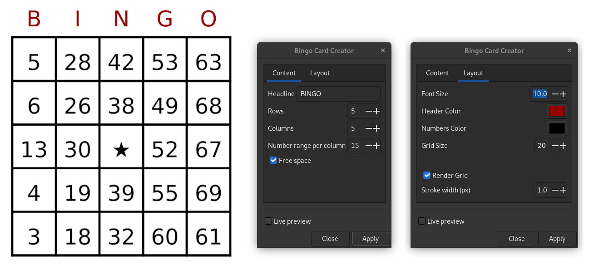

## Inkscape Extension: Bingo Card Creator

Adds "Bingo Card Creator" to the Inkscape Extensions list.

### How To Install

Copy the bingo folder from this repository into the Inkscape extensions folder.

Works with Inkscape 1.2

### How To Use

* Open Extensions > Render > Bingo Card Creator
* Set parameters as necessary and apply

## Bingo Templates

When a template has been opened in Inkscape before this extension is run, it will insert the bingo numbers into the predefined area(s).

Create a bingo template by setting the id of a rectangle to `bingo-area`. For multiple areas append numbers to the id such as `bingo-area_1`. Clones of bingo-area-rectangles or clones of groups can also be used by setting their id accordingly.

Use Inkscapes XML-Editor to add following attributes to the bingo-area-rectangle (optional):

#### Layout options

|Attribute           |Type   |Example |Description
|--------------------|-------|--------|-----------|
|bingo-columns       |int    |5       |Number of columns
|bingo-rows          |int    |5       |Number of rows
|bingo-column-range  |int    |15      |Number range for each column
|bingo-render-grid   |boolean|false   |If set to true a grid will be rendered

#### Headline, font and colors

|Attribute           |Type   |Example |Description
|--------------------|-------|--------|-----------|
|bingo-headline      |string |BINGO   |The headline text (`none`: no headline)
|bingo-font-size     |float  |20.5    |Font Size
|bingo-headline-color|color  |black   |Headline color
|bingo-color         |color  |#000000 |The color for the numbers

#### Free spaces

|Attribute           |Type   |Example |Description
|--------------------|-------|--------|-----------|
|bingo-free-rows     |int    |0       |Count of random free spaces in each row (british bingo)
|bingo-free          |x.y;x.y|1.2;3.3 |Semicolon (;) separated positions for free spaces. X and Y coordinates will be separated by a dot (.)
|bingo-star          |boolean|false   |If set to true, the number in the center will be replaced by a star

If an attribute remains undefined, settings from user input will apply. Attributes will be carried over to subsequent areas - until overwritten.

For a better understanding have a look at the [template example file](resources/template_example.svg) in this repository.